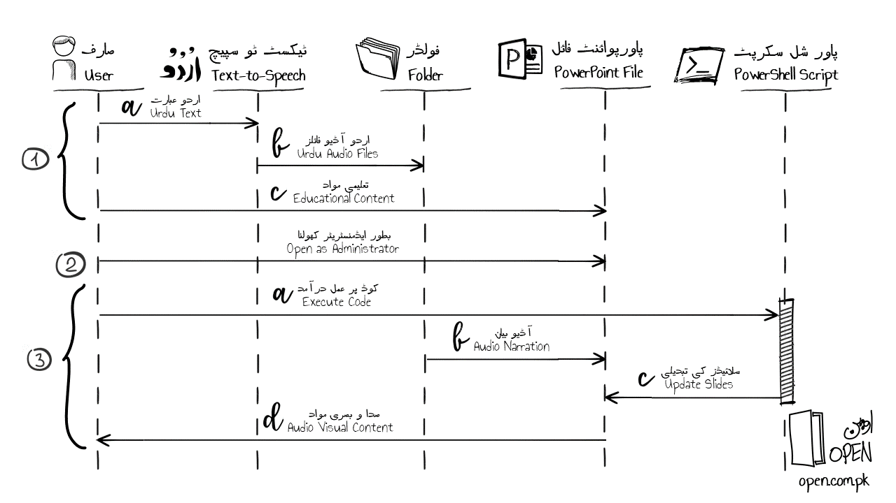

<a href="README.md">انگریزی میں پڑھیے</a>

 
<h1 align="right">مائیکروسافٹ پاورپوائنٹ کو پاور شیل کا استعمال کرتے ہوئے خودکار بنانا</h1>
<h2 align="right">کیوں؟</h2>

مائیکروسافٹ پاورپوائنٹ پیشکش میں اردو آڈیو فائلوں کو دستی طور پر داخل کرنے سے گریز کرنا۔

<h2 align="right">کیا؟</h2>

اس کام کو سیکنڈوں میں خود بخود انجام دینے کیلئے پاور شیل اسکرپٹ۔

<h2 align="right">کیسے؟</h2>
<h3 align="right">ضروریات</h3>

پاورشیل اسکرپٹ فائل کو چلانے کے لئے درج ذیل دو ضروریات ہیں۔ 

<h4 align="right">١۔ پاور شیل آئی ڈی ای</h4>

مائیکرو سافٹ ویژول اسٹوڈیو کوڈ ، ونڈوز پاور شیل آئی ایس ای ، یا پاور شیل اسٹوڈیو ٢٠٢١ میں پاورشیل فائل کھولیے۔ میں نے اپنی مشین پر ونڈوز پاور شیل آئی ایس ای استعمال کی تھی۔

<h4 align="right">٢۔ عمل درآمد کی پالیسی</h4>

اگر سکرپٹ چلاتے وقت آپ کو عیرور کا سامنا کرنا پڑے کہ کوڈ سائنڈ نہیں ہے ، تو آپ کو اپنی مشین پر درج ذیل پاور شیل کمانڈ پر عملدرآمد کرنا ہوگا۔ 

<pre>
Set-ExecutionPolicy -Scope Process -ExecutionPolicy Bypass
</pre>

نوٹ کریں کہ مذکورہ کمانڈ صرف آپ کے موجودہ سیشن کو متاثر کرتی ہے۔

<h3 align="right">اقدامات</h3>

عمل مندرجہ ذیل تین اقدامات پر مشتمل ہوتا ہے ، جیسا کہ اوپر دکھایا گیا ہے: 

<h4 align="right">١۔ مواد کی تخلیق</h4>

اے۔ صارف اردو عبارت کو  ٹیکسٹ ٹو سپیچ نظام میں داخل کرتا ہے۔

 

بی۔ پیدا شدہ اردو آڈیو فائلیں ایک فولڈر میں محفوظ کی جاتی ہیں۔

 

سی۔ تعلیمی مواد کو ایک پاورپوائنٹ پیشکش میں تخلیق اور محفوظ کیا جاتا ہے۔ اس مرحلے پر ، صدائی اور بصری حصے علحدہ علحدہ موجود ہوتے ہیں۔ 

 
<h4 align="right">٢۔ پیشکش فائل</h4>

کمپیوٹر پر بطور ایڈمنسٹریٹر پاورپوائنٹ ایپلیکیشن چلائیے ، اور پریزنٹیشن فائل کھولیے (مرحلہ ١ سی میں تیار کردہ) جس میں آواز کو شامل کرنے کی ضرورت ہے۔

<h4 align="right">٣۔ پاور شل سکرپٹ عمل درآمد</h4>

اے۔ صارف اسکرپٹ فائل کے پاور شیل کوڈ پر عمل درآمد کرتا ہے۔

بی۔ آڈیو فائلوں میں پیشکش کی داستان کو فائل میں ضم کیا جاتا ہے۔ یہ آڈیو فائلوں کے نام سلائڈ نمبر کے مطابق رکھے جاتے ہیں۔
 

سی۔ پاورپوائنٹ سلائڈز کو عمل درآمد شدہ پاور شیل سکرپٹ کے ذریعہ تبدیل کیا جاتا ہے۔
 

ڈی۔ صدائی اور بصری مواد والی سلائڈیں صارف کے استعمال کے لئے تیار کی جاتی ہے۔ یہ بات ذہن میں رکھیں کہ فائل کو دستی طور پر محفوظ کرنے کی ضرورت ہے (یا تو مینو یا شارٹ کٹ-کی کا استعمال کرتے ہوئے) تاکہ تبدیلی کو محفوظ کیا جاسکے۔ 
 

پاور شیل فائل کو یہاں دیکھیں:

<a target="_blank" rel="noopener noreferrer" href="https://github.com/OpenEdPakistan/powershell/blob/main/code/Add-Audio.ps1">https://github.com/OpenEdPakistan/powershell/blob/main/code/Add-Audio.ps1</a>
 

 حوالہ کے لیے کوڈ کو ذیل میں دیا گیا ہے: 

<pre>
[System.Reflection.Assembly]::LoadWithPartialName("Microsoft.Office.Interop.PowerPoint") # Load PowerPoint dll
$pptx = New-Object -ComObject PowerPoint.Application # Create COM object from PowerPoint application

function Add-Audio([Microsoft.Office.Interop.PowerPoint.PresentationClass]$Presentation, [string]$Folder)
{
   Set-ExecutionPolicy -executionpolicy bypass
   for ($i = 1; $i -le $Presentation.Slides.Count; $i++) # For each slide in presentation
   {
      $fileName = $i # Initialize file name
      if ($i -le 9)  # If current slide number is a single-digit number
      {
         $fileName = "0" + $i # Add a zero in the file name
      }
	
      # Add audio file to slide transition
      $Slide = [string]$Presentation.Slides($i).SlideShowTransition.SoundEffect.ImportFromFile($Folder + $fileName + ".wav")
   }

   Write-Output "Done." # Display success message
}

Add-Audio -Presentation $pptx.ActivePresentation -Folder "C:\Folder-Name\" #Execute Function with parameters
</pre>
