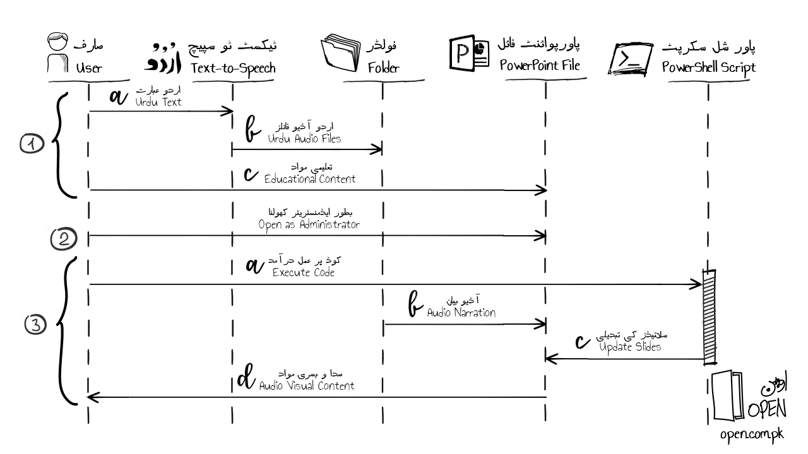

# Automating Microsoft PowerPoint using PowerShell
## Why?
To avoid manually inserting Urdu Audio files (with the .wav extension) into Microsoft PowerPoint presentation.
## What?
PowerShell script to perform the same task automatically in seconds.
## How?
### Pre-requisites
*The following two are pre-requisites for executing the PowerShell script file.*
#### 1. PowerShell IDE
Open the PowerShell file _Add-Audio.ps1_ in Microsoft Visual Studio Code, Windows PowerShell ISE, or PowerShell Studio 2021. I used Windows PowerShell ISE on my machine.
#### 2. Execution Policy
If you get an error that the file is not signed when you run the script, you have to execute the following PowerShell command in your environment.
```
Set-ExecutionPolicy -Scope Process -ExecutionPolicy Bypass
```
*Note that the above command only affects your current session.*
### Steps

*The process comprises the following 3 steps, as shown above:*
#### 1. Create Content
a. The User enters Urdu text into the text-to-speech system.

b. The generated Urdu audio files are stored in a Folder.

c. The educational content is created and stored in a PowerPoint presentation.
*At this stage, the audio and visual parts exist separately.*
#### 2. Open Presentation File
Run the PowerPoint application as an administor on the computer, and open the presentation file that the audio needs to be added to (created in step 1c)
#### 3. Execute PowerShell Script
a. The User executes the PowerShell code in the script file.

b. The narration in the audio files is embedded into the presentation. This is achieved by naming the audio files as numbers, each corresponding to a slide number.

c. The PowerPoint slides are updated by the executed PowerShell script.

d. The slides with the audio and visual content both are ready for use by the User. Keep in mind that the file needs to be saved manually (either by using the menu option or the shortcut-key) in order for the updates to be committed to the disk.

View the PowerShell file here: https://github.com/OpenEdPakistan/powershell/blob/main/code/Add-Audio.ps1
For reference, the code is also given below:
```
[System.Reflection.Assembly]::LoadWithPartialName("Microsoft.Office.Interop.PowerPoint") # Load PowerPoint dll
$pptx = New-Object -ComObject PowerPoint.Application # Create COM object from PowerPoint application

function Add-Audio([Microsoft.Office.Interop.PowerPoint.PresentationClass]$Presentation, [string]$Folder)
{
   Set-ExecutionPolicy -executionpolicy bypass
   for ($i = 1; $i -le $Presentation.Slides.Count; $i++) # For each slide in presentation
   {
      $fileName = $i # Initialize file name
      if ($i -le 9)  # If current slide number is a single-digit number
      {
         $fileName = "0" + $i # Add a zero in the file name
      }
	
      # Add audio file to slide transition
      $Slide = [string]$Presentation.Slides($i).SlideShowTransition.SoundEffect.ImportFromFile($Folder + $fileName + ".wav")
   }

   Write-Output "Done." # Display success message
}

Add-Audio -Presentation $pptx.ActivePresentation -Folder "C:\Folder-Name\" #Execute Function with parameters
```
